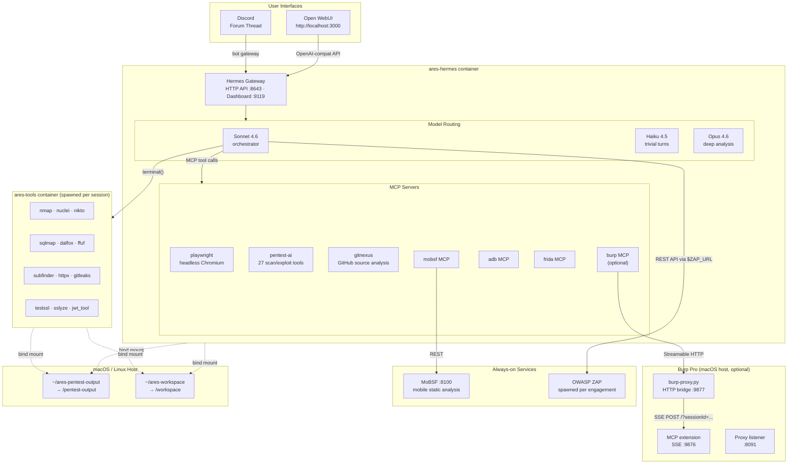
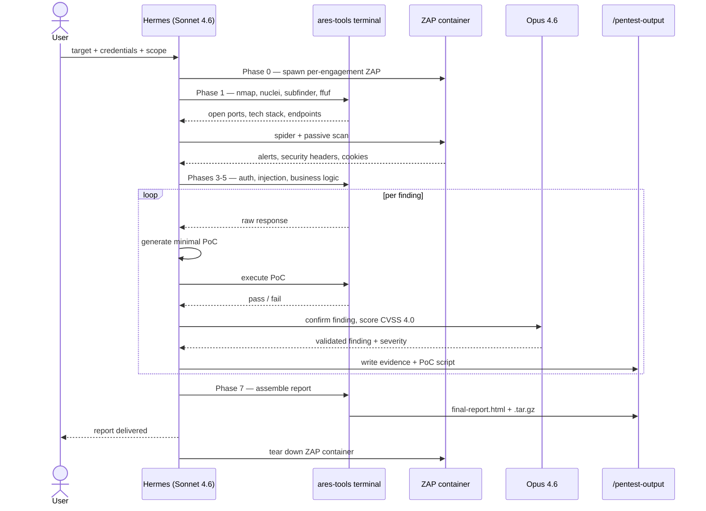
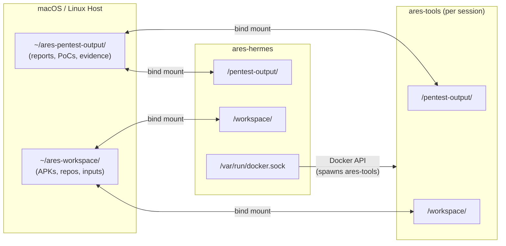
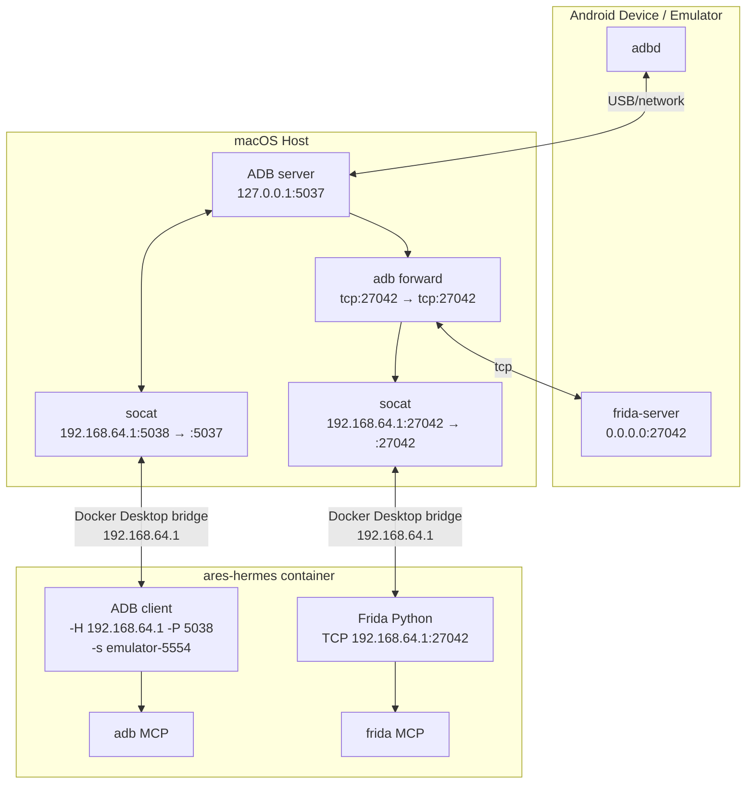

# Ares — Autonomous Pentest Agent

Ares is a penetration testing profile for [Hermes Agent](https://github.com/NousResearch/hermes-agent). It turns a bare server or local workstation into a fully autonomous pentest platform — operated via a web UI, Discord, or both simultaneously.

You send a target URL and credentials. The agent runs a full OWASP WSTG assessment, validates every finding with a working proof of concept, and delivers a Markdown/HTML report with PoC scripts. No manual steps during the engagement.

---

## What It Does

- **Full OWASP WSTG coverage** — 13 testing phases, 80+ test cases across recon, auth, authz, injection, business logic, client-side, API, and mobile
- **Validated findings only** — every finding requires a working PoC before it lands in the report. No theoretical vulnerabilities.
- **Per-engagement isolation** — each run creates `/pentest-output/{target}_{timestamp}/` so parallel engagements never conflict
- **Attack chains** — correlates individual findings into exploitable end-to-end scenarios with CVSS 4.0 scoring
- **Detection engineering** — Sigma rules and MITRE ATT&CK Navigator layers for every validated finding
- **Mobile testing** — static analysis (MoBSF), dynamic instrumentation (Frida SSL unpinning, crypto hooks), device control (ADB)
- **Burp Pro integration** — optional bridge that exposes all 28 Burp MCP tools (proxy history, repeater, scanner, intruder, collaborator) to the agent via `burp-start.sh`
- **White-box support** — clone target repos into `~/ares-workspace/`; the agent reads source at `/workspace/` inside all containers
- **Memory across engagements** — Hindsight extracts findings and patterns after each session, building institutional knowledge over time

---

## Architecture



**Model routing** is tiered by cost and reasoning requirement:

| Model | Role | Triggers |
|-------|------|----------|
| Sonnet 4.6 | Default orchestrator | All phases — coordination, tool execution, parsing, report writing |
| Opus 4.6 | Deep analysis | Exploit confirmation, attack chain building, CVSS scoring |
| Haiku 4.5 | Trivial turns | Auto-routed for JSON extraction, format conversions, simple lookups |

This routing cuts cost ~43% vs full Opus without quality loss on tool execution or report writing.

---

## Engagement Flow



---

## File Exchange

All three paths — `ares-hermes`, `ares-tools` terminal containers, and the host — share the same two bind-mounted directories. No `docker cp` needed; files appear instantly on both sides.



| Directory | Purpose |
|-----------|---------|
| `~/ares-pentest-output/` | **Output** — reports, PoC scripts, screenshots, evidence tarballs. Everything the agent writes during an engagement. |
| `~/ares-workspace/` | **Input / scratch** — drop APKs, clone repos, or place any files the agent needs to read. Also used for agent-to-host handoffs of intermediate files. |

---

## Stack

| Component | Purpose | Port |
|-----------|---------|------|
| [Open WebUI](https://github.com/open-webui/open-webui) | Web UI — multi-engagement chat, model selector | 3000 |
| [Hermes Agent](https://github.com/NousResearch/hermes-agent) v0.9.0+ | Orchestrator, HTTP API, Discord gateway, skill engine | 9119 (dashboard), 8643 (API) |
| [MoBSF](https://github.com/MobSF/Mobile-Security-Framework-MobSF) | Mobile static analysis (APK/IPA/APPX) | 8100 |
| [OWASP ZAP](https://www.zaproxy.org/) | Web scanner, spider, passive scanner | dynamic (per engagement) |
| [pentest-ai](https://github.com/0xSteph/pentest-ai) | MCP server — 27 scan/exploit tools | stdio |
| [Playwright MCP](https://github.com/microsoft/playwright-mcp) | Headless Chromium — DOM testing, auth crawl | stdio |
| MCP: mobsf / adb / frida | Mobile testing MCP servers (vendored in `mcp/`) | stdio |
| `ares-tools` image | Terminal container — all security tools pre-installed | spawned per session |
| Burp Pro + `burp-proxy.py` | Optional — 28 MCP tools: proxy history, repeater, scanner, intruder, collaborator | host :9876 (Burp), :9877 (bridge) |

**Minimum hardware:** 4 cores, 8GB RAM, 50GB disk, macOS (Docker Desktop) or Linux

**Recommended:** 8+ cores, 16GB+ RAM, 200GB SSD (for ZAP + MoBSF + concurrent sessions)

---

## Skills

`skills/pentest-orchestrate/` is the master orchestrator. It runs all 13 phases and delegates to sub-skills:

| Sub-skill | Coverage |
|-----------|----------|
| `pentest-race-condition` | TOCTOU, concurrent request attacks |
| `pentest-websocket` | Auth bypass, CSWSH, frame injection, subscriptions |
| `pentest-graphql` | Introspection, depth bombs, batching bypass, IDOR via resolvers |
| `pentest-supply-chain` | Exposed manifests, .git exposure, CI/CD files, SRI gaps |
| `pentest-cloud-ssrf` | IMDSv1/v2, GCP metadata, Azure IMDS, Kubernetes SA token escalation |
| `pentest-llm-platform-attacks` | OWASP LLM Top 10, prompt injection, cross-tenant data leakage |
| `pentest-creative-edge-cases` | Novel attack surface — polyglots, race+IDOR combos, parser differentials |
| `pentest-detection-engineering` | Sigma rules per finding, MITRE ATT&CK mapping |
| `pentest-framework-enrichment` | ATT&CK techniques, D3FEND countermeasures, NIST CSF subcategories |
| `pentest-attack-navigator` | MITRE ATT&CK Navigator JSON layer export |
| `pentest-attack-flow` | Attack flow diagram generation |
| `pentest-d3fend-advisor` | Defensive roadmap per finding |
| `pentest-report-merge-and-regenerate` | Consolidated Markdown + HTML report assembly |

---

## Testing Phases

| Phase | Coverage |
|-------|----------|
| 0 | Scope lock, per-engagement ZAP container spawn, output dir setup |
| 1 | Recon — nmap, nuclei, subfinder, ZAP spider + AJAX spider, authenticated Playwright crawl, ffuf content discovery |
| 2 | Passive analysis — ZAP alerts, security headers, JS source analysis, cookie flags, client-side storage |
| 3 | Auth & authz — IDOR across all ID parameters, broken function-level auth, mass assignment, JWT attacks, CSRF |
| 4 | Injection — SQLi (sqlmap), XSS (dalfox), DOM XSS (Playwright), SSRF, SSTI, command injection, XXE, file upload abuse |
| 5 | Business logic — race conditions, rate limiting, workflow bypass, WebSocket auth, CORS |
| 6 | Validation + chain building — Opus confirms every finding, builds attack chains, scores CVSS 4.0 |
| 7 | Report — executive summary, per-finding detail with PoC + evidence, Sigma rules, ATT&CK layer, delivery |
| 8 | Error handling — stack traces, framework debug pages |
| 9 | Cryptography — TLS config (testssl.sh), weak hashing, padding oracle |
| 10 | Client-side — DOM XSS sinks, postMessage, XSSI, clickjacking |
| 11 | API — REST rate limiting, BOLA, GraphQL introspection, WebSocket |
| 12 | Business logic deep dive — multi-step workflow bypass, negative quantities, TOCTOU |
| 13 | Mobile — MoBSF static analysis, Frida dynamic (SSL unpinning, crypto hooks), ADB device testing |

---

## Output

Every engagement writes to an isolated directory bind-mounted to the host:

```
~/ares-pentest-output/
  {target-slug}_{YYYYMMDD_HHMMSS}/
    final-report.html           — full technical report, browser-ready
    evidence/
      F-01_sqli_response.txt    — raw request/response for each finding
      phase-2-summary.md        — phase summaries (compaction resilience)
    screenshots/
      F-05_xss.png              — browser evidence for client-side findings
    pocs/
      F-01_sqli.sh              — standalone PoC script per finding
  {target-slug}_{timestamp}-FINAL.tar.gz
```

The report and tarball are delivered as Discord attachments (if Discord is enabled) or accessible via the Open WebUI session.

---

## Quick Start

```bash
git clone https://github.com/your-org/ares.git
cd ares/docker
./setup.sh
```

`setup.sh` prompts for your Anthropic token, optionally Discord, builds images, starts the stack, and verifies everything. First run takes ~5 minutes.

Open **http://localhost:3000** → select a model → start a new chat → send your engagement brief.

**Prerequisites:** Docker Engine + Docker Compose v2, your user in the `docker` group. No root required.

---

### Adding Discord

Answer **y** to the Discord prompt during `setup.sh`, or add to `.env` after setup:

```bash
# docker/.env
DISCORD_BOT_TOKEN=your-bot-token
DISCORD_ALLOWED_USERS=your-discord-user-id
DISCORD_FREE_RESPONSE_CHANNELS=your-forum-channel-id

docker compose --project-name ares restart hermes
```

Each thread in your pentest forum channel becomes an isolated engagement session.

---

### Run an Engagement

**Via Open WebUI:** Open `http://localhost:3000` → new chat → paste your brief:

```
Full web app assessment on https://staging.target.com
Scope: staging.target.com only
Auth: admin@target.com / password123
Test accounts: user1@target.com / pass1, user2@target.com / pass2
Destructive: yes
Go.
```

**Via Discord:** Create a thread in your pentest forum channel and send the same brief.

---

### White-box / Local File Access

Drop anything into `~/ares-workspace/` on the host — it's immediately visible at `/workspace/` inside hermes and every terminal container it spawns, with no restart required.

```bash
# White-box pentest — clone repo locally
cd ~/ares-workspace && git clone https://github.com/your-org/target-app
# → tell Hermes: "review /workspace/target-app/ for auth issues"

# Mobile testing — drop APK
cp MyApp.apk ~/ares-workspace/
# → tell Hermes: "analyze /workspace/MyApp.apk with MoBSF"
```

---

### Mobile Testing (Android)



The ADB and Frida MCP servers run inside `ares-hermes` and reach the device via socat bridges on the Docker Desktop VM interface (`192.168.64.1`). No USB passthrough into Docker required.

**Setup (one-time per machine):**

```bash
# Install prerequisites
brew install socat android-platform-tools
# Install Android Studio → SDK Manager → Android 14 (API 34) + Emulator

# Configure Android + start stack
cd ares/docker && ./setup.sh --android
```

**Start bridges each session:**

```bash
cd ares/docker && bash mobile-start.sh          # emulator
cd ares/docker && bash mobile-start.sh --usb    # USB phone
```

`mobile-start.sh` starts the emulator (if needed), pushes frida-server, starts socat bridges, and verifies connectivity from inside hermes. Keep the terminal open — bridges stop when it closes.

**Device scenarios:**

| Scenario | `ADB_SERIAL` | Notes |
|----------|-------------|-------|
| macOS Android Studio AVD | `emulator-5554` | Serial the ADB server assigns to the emulator |
| Linux Docker emulator | `localhost:5555` | Docker emulator exposes ADB on port 5555 |
| USB phone (host) | serial from `adb devices` (e.g. `R58N12345`) | |
| Wi-Fi / Tailscale phone | `<device-ip>:5555` | |

> **macOS note:** `host.docker.internal` resolves to the Docker VM bridge, not the Mac. `setup.sh --android` detects the correct IP (`192.168.64.1`) automatically.

**Linux (Docker emulator, requires `/dev/kvm`):**

```bash
docker compose --project-name ares --profile android up -d
# View emulator screen at http://localhost:6080
```

---

### Burp Pro Integration (optional)

Ares can use Burp Pro's official MCP extension to give the agent direct access to proxy history, Repeater, Intruder, the active scanner, and Collaborator. This is optional — the stack works without Burp.

**Transport bridge:** Burp's MCP extension uses an SSE-based transport, while Hermes uses Streamable HTTP. `docker/burp-proxy.py` is a lightweight stdlib-only Python bridge between the two — no extra dependencies required.

**Prerequisites:**

1. Burp Pro running with the MCP extension (BApp Store) on `127.0.0.1:9876`
2. A Burp proxy listener on `192.168.64.1:8091` (for traffic interception — configure in `Proxy > Listener`)

**Start the integration:**

```bash
cd ares/docker
./burp-start.sh
```

`burp-start.sh` does:
1. Verifies Burp MCP is reachable on `127.0.0.1:9876`
2. Optionally checks the proxy listener on `192.168.64.1:8091`
3. Starts `burp-proxy.py` (SSE↔HTTP bridge on `192.168.64.1:9877`)
4. Restarts `ares-hermes` so it picks up the Burp MCP server

On the next agent session, 28 Burp tools are registered automatically:

| Tool group | Tools |
|-----------|-------|
| HTTP sending | `send_http1_request`, `send_http2_request` |
| Traffic review | `get_proxy_http_history`, `get_proxy_http_history_regex`, `get_proxy_websocket_history` |
| Active tools | `create_repeater_tab`, `send_to_intruder` |
| Scanner | `get_scanner_issues` |
| Collaborator | `generate_collaborator_payload`, `get_collaborator_interactions` |
| Config | `output_project_options`, `set_project_options`, `set_proxy_intercept_state` |
| Encoding | `url_encode`, `url_decode`, `base64_encode`, `base64_decode` |

**Stop:**

```bash
./burp-start.sh --stop
```

**Why a custom bridge?**
Hermes uses Streamable HTTP (POST /) for MCP connections. Burp's MCP extension uses the older SSE transport: `GET /` returns a session endpoint, then `POST /?sessionId=xxx` carries JSON-RPC, and responses arrive back over the SSE stream. The two protocols are incompatible. `burp-proxy.py` maintains a persistent SSE connection to Burp, correlates responses by JSON-RPC `id`, and presents a plain HTTP interface to Hermes.

---

### Bare-Metal via Claude Code

For production deployments — full Hindsight memory, physical device testing, no Docker Desktop overhead.

Open Claude Code and run:

```
Deploy the Ares pentest stack following CLAUDE.md at https://github.com/your-org/ares
Target machine: USER@HOST (password: PASSWORD)
```

Claude Code reads `CLAUDE.md` and executes the full install remotely via SSH — tools, containers, Hermes profile, Discord gateway — stopping only at human action points (OAuth login, API keys, Discord bot setup).

---

## Security Tools (ares-tools image)

All tools are pre-installed in the terminal container that Hermes spawns per session:

| Category | Tools |
|----------|-------|
| Web scanning | nmap, nuclei, nikto, whatweb, wafw00f |
| Fuzzing | ffuf, sqlmap |
| XSS / injection | dalfox, commix |
| TLS/SSL | sslyze, testssl.sh |
| Recon | subfinder, httpx |
| Secrets | gitleaks, jwt_tool |
| Mobile | adb, frida (via MCP) |
| Wordlists | SecLists common.txt, raft-medium-dirs.txt, api-endpoints.txt |

---

## Key Design Decisions

**Why Open WebUI?**
Clean multi-conversation UI without requiring a Discord bot. Connects to Hermes's OpenAI-compatible API endpoint (`/v1`), supports multiple simultaneous sessions, and has a model selector for switching between profiles. No forks, no custom frontend code.

**Why Hermes?**
Multi-model orchestrator with persistent sessions, skill routing, HTTP API server, and MCP server management. A 100+ turn pentest session exhausts a single Claude conversation context — Hermes handles compression, model routing, and resumption automatically.

**Why not ZAP MCP?**
ZAP MCP addon v0.0.1 alpha hardcodes `127.0.0.1` as its bind address and enforces HTTPS. Both `-config` flags to override these are ignored at runtime. Ares uses ZAP via its REST API directly instead.

**Why per-engagement ZAP containers?**
A shared ZAP instance accumulates state across engagements — old scan trees, stale alerts, mixed session data. Per-engagement containers give each run a clean ZAP state, then are torn down after report delivery.

**Why delegate CVSS to Opus?**
In controlled testing, Sonnet consistently downgraded severity by one tier on auth bypass, mass assignment, and JWT storage findings compared to Opus. CVSS scoring is delegated to Opus with explicit calibration guidance to prevent systematic under-rating.

**Why a custom bridge for Burp MCP instead of using Burp's SSE endpoint directly?**
Hermes's MCP client (`streamable_http_client` from `mcp` 1.27+) speaks Streamable HTTP only — it POSTs JSON-RPC to `/` and expects a JSON response body. Burp's MCP extension speaks the legacy SSE transport — `GET /` establishes a stream that delivers a `sessionId`, then `POST /?sessionId=xxx` carries requests, and responses come back over the SSE channel asynchronously. The two are wire-incompatible. `burp-proxy.py` handles the SSE channel management and per-request `Queue`-based correlation entirely in ~150 lines of stdlib Python.

**Why socat on macOS instead of `adb -a`?**
On macOS, Android Studio's ADB daemon respawns immediately and re-locks itself to `127.0.0.1`. The `-a` flag is silently ignored. socat bridges the Docker Desktop VM network to the Mac's localhost ADB, which works regardless of which process owns the ADB server.

---

## Configuration Reference

`docker/config.yaml` is baked into `ares-hermes` at build time. Key settings:

```yaml
model:
  default: claude-sonnet-4-6
  provider: anthropic

smart_model_routing:
  enabled: true
  cheap_model:
    model: claude-haiku-4-5-20251001

compression:
  threshold: 0.50       # compress when context reaches 50% of window
  protect_last_n: 30    # keep last 30 turns verbatim

terminal:
  backend: docker
  docker_image: ares-tools:latest
  container_persistent: true
  docker_volumes:
    - "${PENTEST_OUTPUT}:/pentest-output"
    - "${WORKSPACE_DIR}:/workspace"
    - "/var/run/docker.sock:/var/run/docker.sock"
```

> **Important:** `${VAR:-default}` bash fallback syntax in `config.yaml` is NOT expanded by Hermes — it's passed as a literal string. Use plain `${VAR}` and set all defaults in `.env`.

---

## Limitations

- **Authorization required.** The profile will not proceed without explicit scope confirmation.
- **No WAF bypass.** Ares uses standard tool flags. Evasion against enterprise WAFs requires manual tuning.
- **Android emulator** (`--profile android`) requires `/dev/kvm` — bare metal only.
- **GitNexus** is [PolyForm Noncommercial](https://polyformproject.org/licenses/noncommercial/1.0.0/) — personal/internal use only.
- **Open WebUI** cannot directly accept binary file uploads (APKs, binaries) — use `~/ares-workspace/` for files Hermes needs to access.

---

## License

MIT. Component licenses: pentest-ai (MIT), GitNexus (PolyForm Noncommercial), Hermes Agent (Apache 2.0), ZAP (Apache 2.0), MoBSF (GPL-3.0), Frida (wxWindows Library License), Open WebUI (MIT).
