# Ares — Architecture & Component Reference

Ares is an autonomous penetration testing platform built on the Hermes agent runtime.
It runs a structured multi-phase assessment — web application, mobile (Android), or CI/CD pipeline —
and produces a consolidated report with working PoC scripts for every finding.

Every finding passes through a live execution loop before it appears in the report.
There are no theoretical vulnerabilities.

---

## System Architecture

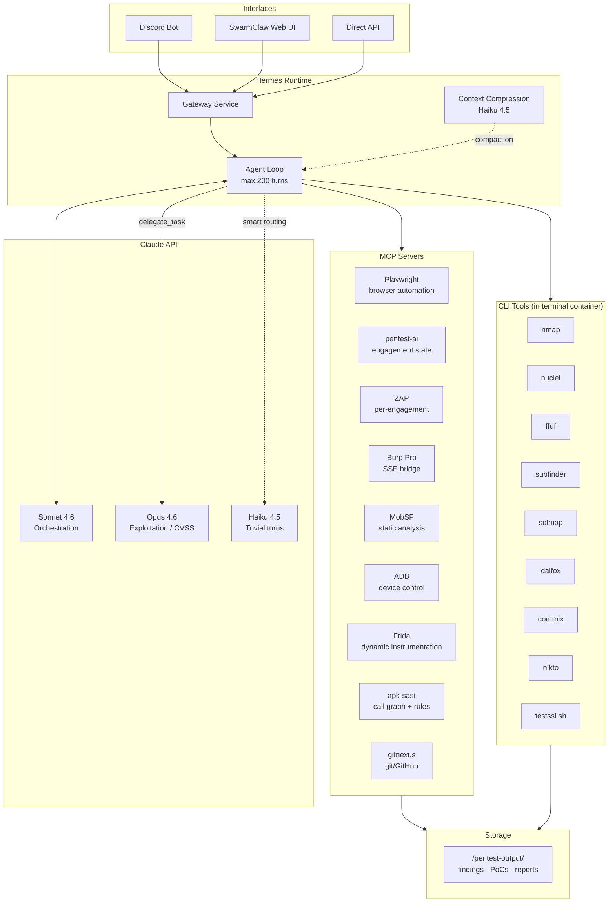

---

## Deployment Modes

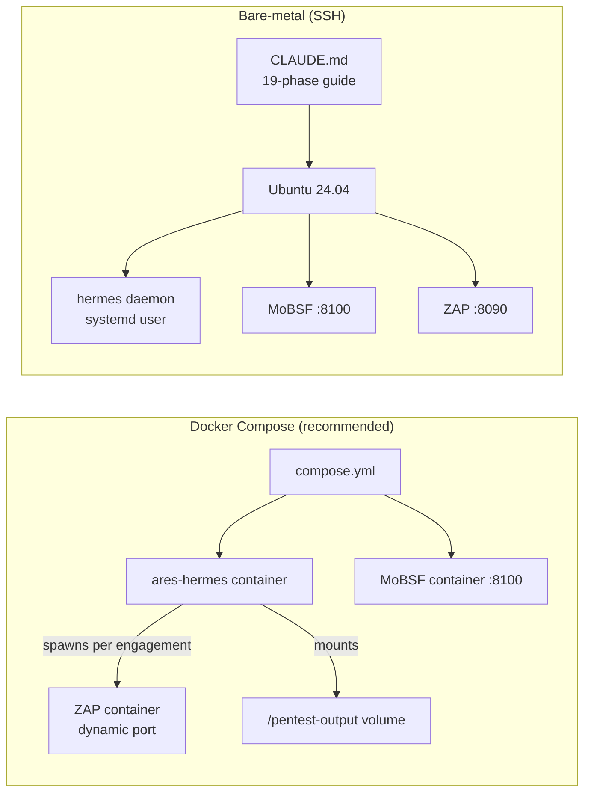

| | Docker Compose | Bare-metal |
|---|---|---|
| Setup time | ~20 min | ~2 hours |
| ZAP | Per-engagement container | Shared instance |
| MCP paths | `/opt/mcp/` | `/home/USER/tools/iris/` |
| Config | `docker/config.yaml` | `config.yaml` |

---

## MCP Server Stack

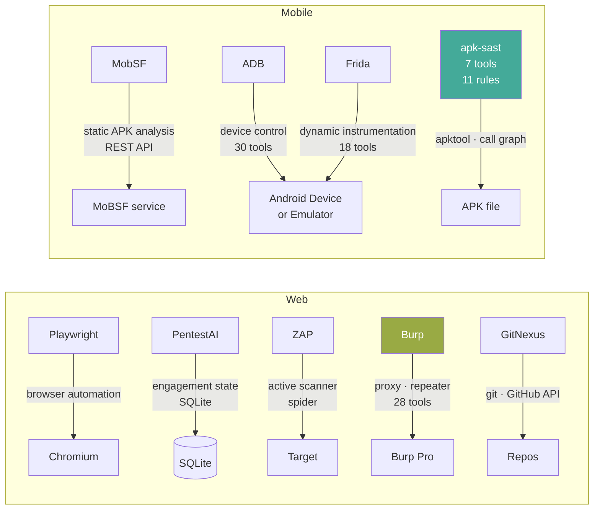

### apk-sast tools

| Tool | Purpose |
|---|---|
| `decompile_apk` | Run apktool + jadx, return paths |
| `parse_manifest` | Structured AndroidManifest.xml JSON |
| `build_call_graph` | Smali `invoke-*` → caller/callee map |
| `grep_smali` | Regex over in-scope Smali files |
| `run_rule_context` | Aggregate all evidence for one rule **(primary)** |
| `list_rules` | All rules with MASVS refs |
| `get_masvs` | MASVS v2.0 control lookup |

---

## Skill Architecture

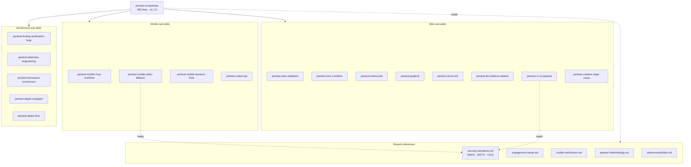

---

## Web Pentest Flow

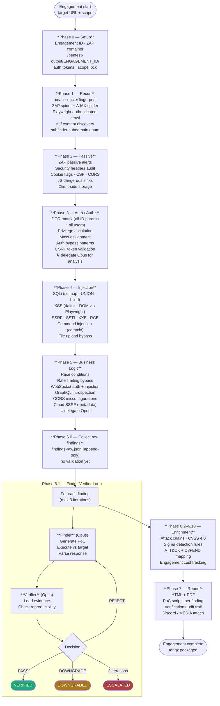

---

## Mobile Testing Flow (Android)

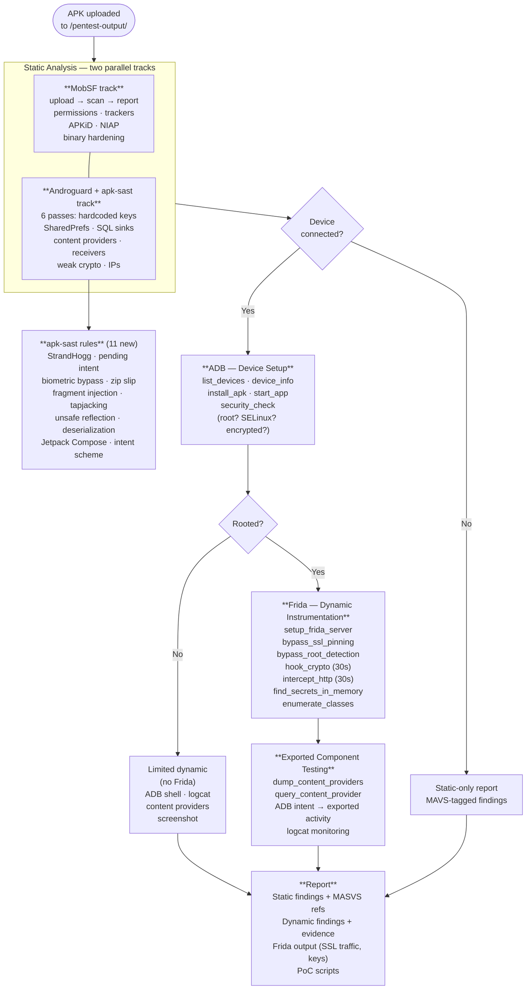

---

## The Finder-Verifier Loop

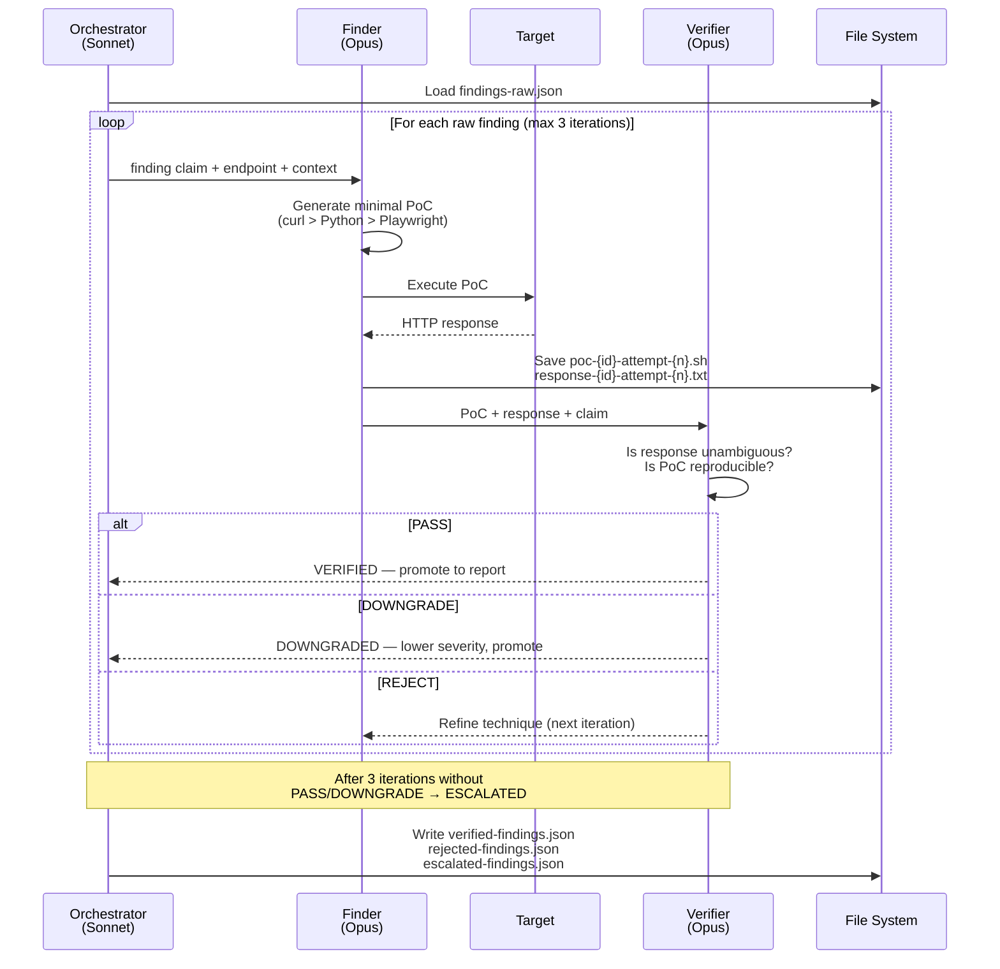

**Finding states:**

| State | Condition | Report |
|---|---|---|
| VERIFIED | PoC confirmed, evidence unambiguous | Main report |
| DOWNGRADED | Severity reduced, still exploitable | Main report (lower severity) |
| REJECTED | PoC failed, same technique twice | Excluded (logged) |
| ESCALATED | 3 iterations, no consensus | Separate section + manual review |

---

## Model Routing

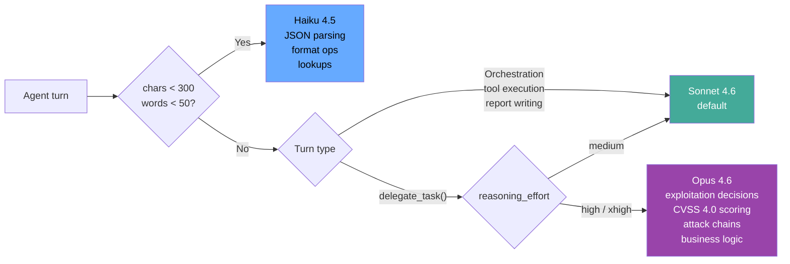

**Opus is explicitly delegated for:**
- Phase 3–5 exploitation analysis
- CVSS 4.0 scoring (calibrated — Sonnet under-rates auth bypass / mass assignment)
- Attack chain building
- Finder and Verifier agents in the verification loop

**Cost reduction:** ~43% vs full-Opus by routing trivial turns to Haiku.

---

## Engagement Isolation

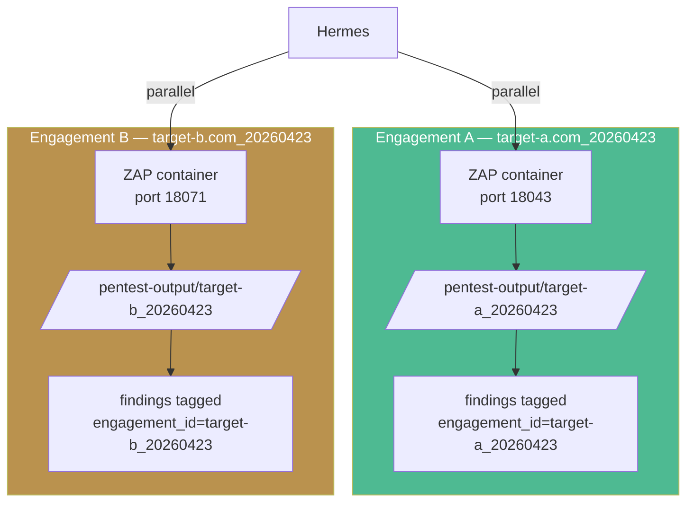

Each engagement gets:
- Unique `ENGAGEMENT_ID = {target_slug}_{timestamp}`
- Dedicated ZAP container on a random port (18000–19000)
- Isolated output directory
- Findings tagged with `engagement_id` (prevents cross-contamination in the verification loop)
- Checkpoint file for sandbox-reset recovery

---

## Standards Coverage

Every finding across all skills includes a `standard_ref` field.

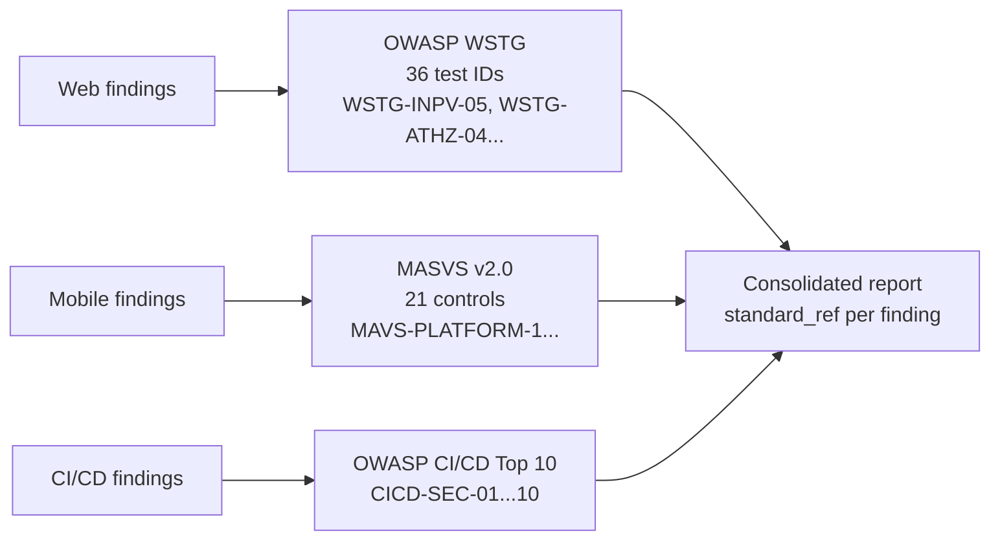

**Finding format:**
```json
{
  "id": "F-03",
  "title": "Mutable PendingIntent in NotificationHelper",
  "severity": "High",
  "cvss": 7.1,
  "standard_ref": {
    "id": "MASVS-PLATFORM-1",
    "name": "The app uses IPC mechanisms securely",
    "url": "https://mas.owasp.org/MASVS/controls/MASVS-PLATFORM-1/"
  }
}
```

Full reference: [`skills/shared/security-standards.md`](../skills/shared/security-standards.md)

---

## Report Deliverables

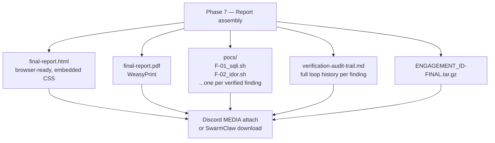

Each PoC script is self-contained, matches the exact request/response from the verification loop, and runs without modification against the target.

---

## Key Constraints

| Constraint | Value | Reason |
|---|---|---|
| Output dir | `/pentest-output/` | Bind-mounted persistent volume. Never `/tmp/` |
| ZAP address | `$ZAP_URL` from `/tmp/engagement.env` | Per-engagement dynamic port |
| MobSF | host only, not in terminal | `MOBSF_URL` + `MOBSF_API_KEY` env vars |
| Playwright | `browser_evaluate`, not `browser_execute_script` | execute_script crashes MCP process |
| delegate_task | returns text, never writes files | container isolation — write from main agent |
| Tool output cap | varies (40–100 lines) | context pollution prevention |
| Frida | must run as root on device | `su 0` before frida-server start |
| Opus stream timeout | `HERMES_STREAM_STALE_TIMEOUT=900` | xhigh reasoning silent for 3–5 min |

Full pitfall list: [`skills/pentest-orchestrate/references/pitfalls.md`](../skills/pentest-orchestrate/references/pitfalls.md)
